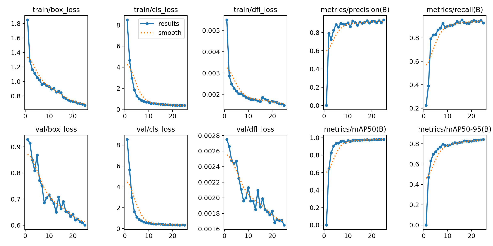
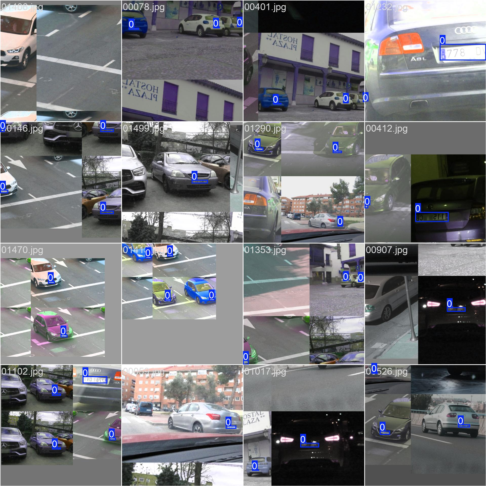
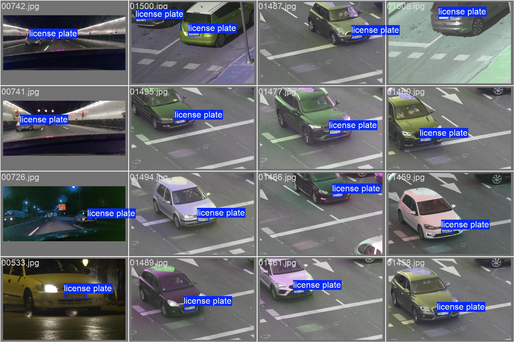
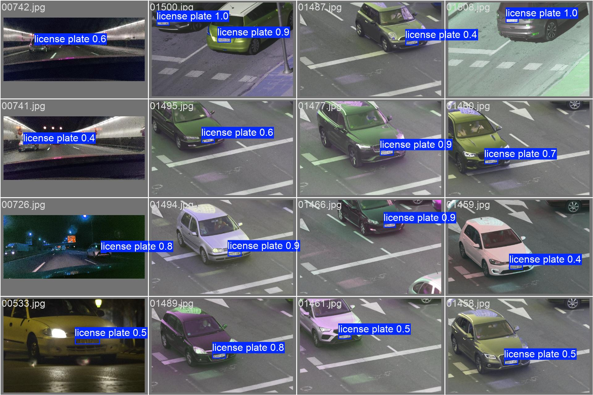

# License Plate Recognition with YOLO26n

<p align="center">
  
  
  
  
</p>


This is a validation project designed to evaluate the performance of the latest **YOLO26n** release (developed by [@ultralytics](https://github.com/ultralytics)) for license plate recognition (LPR) tasks.

Beyond providing the tools to work with license plate detection, this repository is structured as an **educational guide** for those who want to start in the world of computer vision. You will learn everything from custom dataset preparation to training and deploying YOLO models.

> [!NOTE]
> I would like to express my sincere gratitude to **Alvaro Ramajo-Ballester** ([@ramajoballester](https://github.com/ramajoballester)) for creating the UC3M-LP dataset and making it publicly available. His work provides a fantastic foundation for developers and researchers to build and validate LPR systems.

## Index
- [Project Structure](#project-structure)
- [Dataset used - UC3M-LP](#dataset-used---uc3m-lp)
- [Citation](#citation)
- [Download](#download)
- [Transform to YOLO format](#transform-to-yolo-format)
- [YOLO Model Training](#yolo-model-training)
- [Results and Analysis](#results-and-analysis)
- [Inference and Video Compilation](#inference-and-video-compilation)
- [License](#license)

## Project Structure

To help you navigate the repository, here is the organizational structure of the project:

```text
.
├── LP/                     # Processed dataset for License Plate detection
│   ├── images/             # Images split into train and val
│   │   ├── train/
│   │   └── val/
│   └── labels/             # YOLO format labels for detection
│       ├── train/
│       └── val/
├── OCR/                    # Processed dataset for Character Recognition
│   ├── images/             # Cropped LP images split into train and val
│   │   ├── train/
│   │   └── val/
│   └── labels/             # YOLO format labels for each character
│       ├── train/
│       └── val/
├── assets/                 # Video files and demo recordings
├── cfg/                    # YAML configuration files for training
├── docs/                   # Documentation assets (images, results, examples)
├── runs/                   # YOLO training outputs
│   └── detect/             # Detection experiments
│       ├── lp_detector/    # Weights and metrics for LP detection
│       └── ocr_detector/   # Weights and metrics for OCR
├── scripts/                # Utility scripts for data conversion
├── train/                  # Original training images (raw)
├── test/                   # Original test images (raw)
├── compile.py              # Script for full LPR inference on custom videos
├── training.py             # Script to launch YOLO26n training
└── yolo26n.pt              # Base YOLO26n model weights
```


## Dataset used - UC3M-LP

The [UC3M-LP dataset](https://github.com/ramajoballester/UC3M-LP) is split into train, with 1580 images (80%), and test, with 395 images (20%). Each one of the 2547 license plates has been labeled with a two letter code. The first letter refers to the typology of Spanish license plates:

- Type A: 2498 samples of the most common long, one row with white background.

<p align='center'>
    
</p>

- Type B: 31 samples of motorcycle double row and white background.

<p align='center'>
    
</p>

- Type C: 1 sample of light motorcycle one row with yellow background.

<p align='center'>
    
</p>

- Type D: 11 samples of taxis and VTC (Spanish acronym for private hire vehicle) with blue background.

<p align='center'>
    
</p>

- Type E: 6 samples of trailer tows with black characters and red background.

<p align='center'>
    
</p>


and the second letter refers to the lighting conditions:

- Type D: 2185 samples at daytime.
- Type N: 362 samples at nighttime.


### Citation

If you use this dataset in your research, please cite the following paper:

```
@article{RamajoBallester2024,
    title = {Dual license plate recognition and visual features encoding for vehicle identification},
    journal = {Robotics and Autonomous Systems},
    volume = {172},
    pages = {104608},
    year = {2024},
    issn = {0921-8890},
    doi = {https://doi.org/10.1016/j.robot.2023.104608},
    url = {https://www.sciencedirect.com/science/article/pii/S0921889023002476},
    author = {Álvaro Ramajo-Ballester and José María {Armingol Moreno} and Arturo {de la Escalera Hueso}},
    keywords = {Deep learning, Public dataset, ALPR, License plate recognition, Vehicle re-identification, Object detection},
}
```

### Download

The dataset is available for [download](https://doi.org/10.21950/OS5W4Z). Alternative [download link](https://zenodo.org/records/17152029).


### Transform to YOLO format

The dataset is provided in a custom format. To transform it to YOLO format, please follow these instructions:

1. Clone the repository:

```bash
git clone https://github.com/Mrchuki/lp-computer-vision.git
cd lp-computer-vision
```

2. Install the required dependencies:

```bash
pip install -r requirements.txt
```

3. Download and extract the dataset files and create this directory structure:

```
path/to/lp-computer-vision/
└─── train
│   └─── 00001.jpg
│   └─── 00001.json
│   └─── 00002.jpg
│   └─── 00002.json
│   └─── ...
└─── test
│   └─── 00001.jpg
│   └─── 00001.json
│   └─── 00002.jpg
│   └─── 00002.json
│   └─── ...
└─── train.txt
└─── test.txt
```

4. Run the script to transform the dataset to YOLO format. It will create 2 versions of the dataset, one for LP detection from the whole image and another one for LP recognition from the cropped LP region (OCR). The script will resize the images to the specified dimensions and save the resulting images and labels in in new directories. You can specify the desired dimensions for the images as arguments of the script.

```bash
python scripts/labels2yolo.py path/to/lp-computer-vision 640 640
```

Run `python scripts/labels2yolo.py -h` for more information.

## YOLO Model Training

For this project, we have trained two specialized models using the **YOLO26n** architecture:

1.  **License Plate Detector (LP Detector):** Trained to locate the license plate within the full image of the vehicle.
2.  **Character Recognition (OCR Detector):** Trained to identify individual characters within the license plate region.

### Training Steps

To replicate the training, you can use the `training.py` script. Ensure you have the corresponding `.yaml` file configured in the `cfg/` folder.

```python
from ultralytics import YOLO

# Load the base model (YOLO26 Nano)
model = YOLO("yolo26n.pt")

# Start training
model.train(
    data="cfg/CV-LP-lp.yaml",  # Example for LP detection
    epochs=25,                # Number of iterations
    imgsz=640,                 # Image size
    batch=32,                   # Batch size
    device="mps",              # '0' for GPU, 'cpu' for CPU, 'mps' for Mac
    name="lp_detector",        # Experiment name
)
```

## Results and Analysis

Following the validation process, the models have demonstrated exceptional performance. In this section, we will focus specifically on the **License Plate Detector (LP Detector)** results and performance metrics.

### 1. Training Environment & Performance Metrics
The training was conducted on a **MacBook Pro with Apple M3 chip and 16GB of RAM**, utilizing the Metal Performance Shaders (MPS) for acceleration. This setup allowed for high efficiency, achieving an average inference speed of ~18.7ms per image.

The following plot shows the convergence of the model during training. We can observe how the loss decreases and the precision/recall metrics improve rapidly.



**Raw Training Results:**
```text
Ultralytics 8.4.2 🚀 Python-3.10.19 torch-2.9.1 MPS (Apple M3)
YOLO26n summary (fused): 122 layers, 2,375,031 parameters, 0 gradients, 5.2 GFLOPs
                 Class     Images  Instances      Box(P          R      mAP50  mAP50-95)
                   all        395        491      0.941      0.927       0.98      0.843
```

| Metric | Value |
| :--- | :--- |
| **mAP50** | 0.98 |
| **Precision (P)** | 0.941 |
| **Recall (R)** | 0.927 |
| **Inference Speed** | 18.7ms / image |

### 2. Training Batches
Here we can see a sample of the training data after being processed and augmented. These batches help us understand how the model "sees" the license plates during the learning phase.



### 3. Validation and Predictions
Finally, we compare the ground truth (labels) with the model's predictions on the validation set. The high overlap between the green boxes (predictions) and the actual license plates confirms the model's high reliability.

<p align="center">
  
  
</p>

### Conclusion
The **YOLO26n** architecture proves to be highly efficient for LPR tasks. By focusing on the detection phase, we ensure that the subsequent OCR stage receives high-quality crops, which is fundamental for accurate character recognition. The results shown in the video cover demonstrate how these metrics translate into a robust real-time system.

## Inference and Video Compilation

Once the models are trained, you can use `compile.py` to run the full pipeline (Detection + OCR) on any custom video. This script is designed to let you see the model in action with your own data.

### How to use it:
1. Place your video in the `assets/` folder.
2. Update the `video_path` variable in `compile.py`.
3. Run the script:

```bash
python compile.py
```

The script will process the video frame by frame, detect license plates, recognize characters, and generate a new video file (e.g., `video_compiled.MOV`) with the annotations and a real-time detection UI, just like the one shown in the demo!

---

## License

This project is licensed for **academic and research purposes only**. Commercial use of any part of this project (code, models, or documentation) is strictly prohibited without prior written consent from the author.

If you wish to use this project for commercial or profit-making purposes, please contact me directly.
